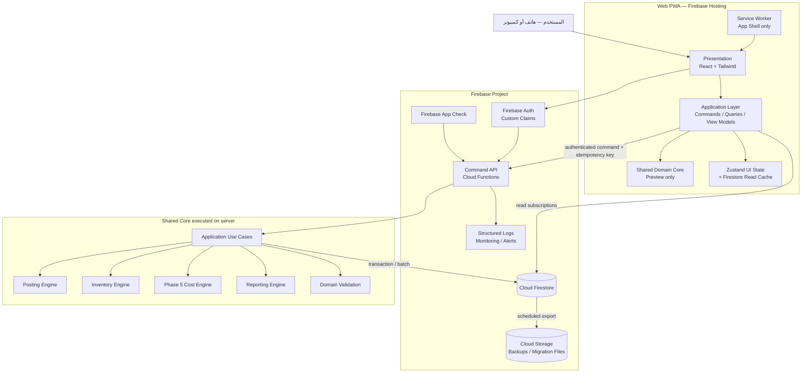
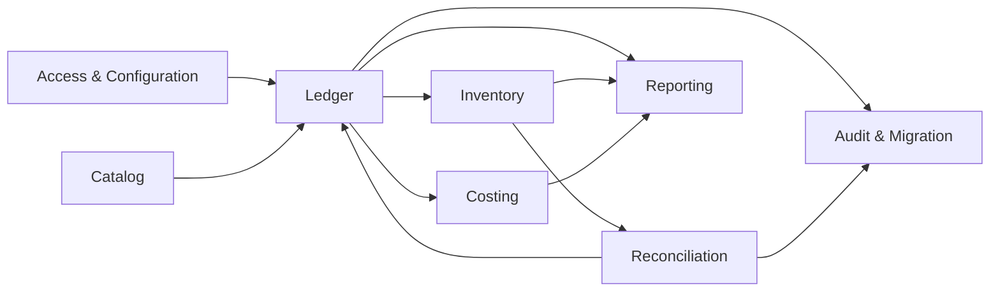
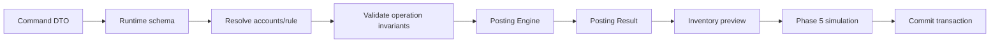
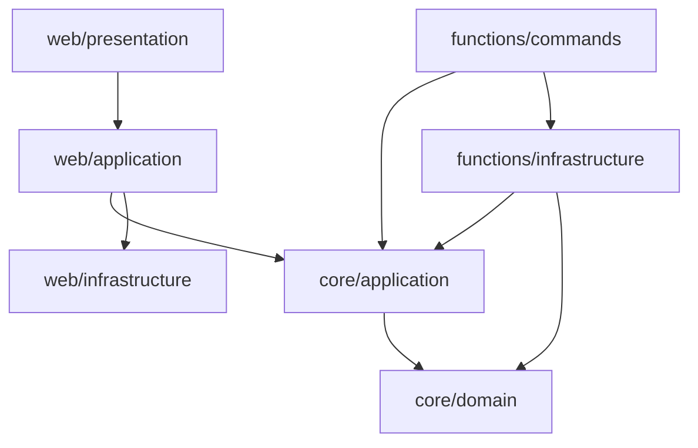

# وثيقة معمارية النظام

## نظام مكة لإدارة محلات الذهب والفضة

| البيان | القيمة |
|---|---|
| نوع الوثيقة | Production Architecture Reference |
| الإصدار | 1.0 |
| الحالة | Official |
| تاريخ الإصدار | 28 يوليو 2026 |
| المرجع الوظيفي | `PRD.md` — v1.1 Final/Frozen |
| النمط المعماري | Clean Architecture داخل Modular Monolith |
| المنصة | React + TypeScript + Tailwind CSS + Firebase + PWA |

> هذه الوثيقة هي المرجع الرسمي للمعمارية.
>
> `PRD.md` وحده هو مصدر قواعد المنتج والعمل والمحاسبة. لا تعيد هذه الوثيقة تعريف قاعدة تجارية أو تغيرها.

---

## 1. أهداف المعمارية

تهدف المعمارية إلى:

- تنفيذ PRD v1.1 دون تغيير قواعده.
- وجود نسخة واحدة فقط من كل قاعدة عمل.
- فصل المحاسبة والتكلفة والمخزون عن React وFirebase.
- منع أي كتابة محاسبية لا تمر بالتحقق المركزي.
- الحفاظ على Legacy Ledger كدفتر التشغيل، وPhase 5 كمصدر التكلفة، وCanonical كـPreview.
- دعم الهاتف أولًا وPWA بنمط `Online-first`.
- التوسع تدريجيًا دون Microservices أو بنية موزعة مبكرة.
- جعل الاختبار والاستبدال والترحيل ممكنًا دون إعادة كتابة المنتج.

### 1.1 مبادئ إلزامية

1. **Domain-first:** قواعد العمل موجودة فقط داخل Domain Engines.
2. **Server-authoritative writes:** الخادم هو الحكم النهائي لكل كتابة محاسبية.
3. **One-way dependencies:** الاعتماد يتجه إلى الداخل نحو Domain.
4. **Pure engines:** المحركات لا تقرأ Firebase ولا تعرف React ولا الوقت الحالي.
5. **Explicit modes:** Legacy وPhase 5 وCanonical لا تُخلط ضمنيًا.
6. **Fail-closed:** البيانات المجهولة أو التكلفة غير الصالحة تمنع الكتابة.
7. **Derived data is disposable:** يمكن إعادة بناء التقارير ونتائج التكلفة من القيود والإعدادات.
8. **Online-first:** لا توجد كتابة محاسبية جديدة Offline في v1.1.
9. **Mobile-first:** قرارات العرض والأداء تبدأ من الهاتف.
10. **No speculative distribution:** يبقى النظام Modular Monolith ما لم تثبت الحاجة إلى فصل خدمة.

---

## 2. System Architecture

### 2.1 النمط العام

النظام Modular Monolith في مستودع واحد، ويتكون من:

- **Web PWA:** واجهة React تُستضاف على Firebase Hosting.
- **Shared Core:** حزمة TypeScript تحتوي Domain Engines وApplication Use Cases والعقود.
- **Command API:** Firebase Callable/HTTPS Functions لكل عمليات الكتابة.
- **Firestore:** المصدر الدائم للقيود والحسابات والإعدادات والجرد والتدقيق.
- **Firebase Auth:** هوية المستخدم.
- **Firebase App Check:** تقليل إساءة استخدام API.
- **Derived Projections:** نتائج Phase 5 وحالات المخزون والتقارير القابلة لإعادة البناء.
- **Cloud Storage:** نسخ Firestore الاحتياطية وملفات الترحيل المعتمدة.

الواجهة تقرأ بيانات المستخدم من Firestore، لكنها لا تكتب مباشرة إلى المجموعات المحاسبية. الكتابة تمر عبر Command API الذي يستدعي نفس Domain Engines المستخدمة في معاينة الواجهة.

### 2.2 مصدر الحقيقة

| البيانات | مصدر الحقيقة |
|---|---|
| قواعد المنتج | `PRD.md` |
| قواعد العمل البرمجية | `packages/core/src/domain` |
| القيود الأصلية | `entries` |
| الحسابات والقواعد | `accounts`, `transactionRules`, `customRules` |
| حالة Ledger Revision | `ledger_heads` |
| تكلفة المخزون وCOGS والربح | آخر `cost_run` صالح لنفس Ledger Revision |
| الجرد | `inventory_checks` مع القيد المرتبط |
| الصلاحية | Firebase Auth Custom Claims + Firestore Rules |
| التدقيق | `audit_logs` |
| أسعار السوق | `settings` |
| Canonical | Shadow collections/results فقط |

أي Cache أو Zustand state أو Report View Model ليس مصدر حقيقة دائمًا.

### 2.3 قرار معماري AD-01

| البند | القرار |
|---|---|
| القرار | Modular Monolith داخل npm workspaces |
| لماذا | المنتج له Domain معقد لكنه Deployable واحد وحجم بيانات حالي محدود. الحدود المنطقية مطلوبة، والتوزيع الشبكي غير مطلوب |
| Trade-offs | يحتاج انضباطًا في Module Boundaries؛ فشل Deploy قد يؤثر في أكثر من Module |
| البدائل المرفوضة | Microservices: تعقيد تشغيل واتساق موزع بلا فائدة حالية. Frontend-only: لا يضمن صحة الكتابة أو الصلاحيات. ملف React واحد: يكرر القواعد ويمنع الاختبار |

---

## 3. High-Level Component Diagram



### 3.1 اتجاه البيانات

- **Query path:** Firestore → Repository Adapter → Application Query → View Model → React.
- **Command path:** React → Command DTO → Cloud Function → Use Case → Domain Engines → Firestore transaction.
- **Preview path:** Form draft → Shared Domain Engine → غير دائم؛ لا يمنح نجاحًا نهائيًا.
- **Projection path:** Entry commit → Cost/Inventory projection → versioned derived documents.

### 3.2 قرار معماري AD-02

| البند | القرار |
|---|---|
| القرار | فصل Command وQuery paths دون تطبيق CQRS موزع |
| لماذا | القراءة تحتاج اشتراكات سريعة، بينما الكتابة تحتاج تحققًا ذريًا موثوقًا |
| Trade-offs | يوجد مساران تقنيان يجب توثيقهما، وقد تتأخر Projection لحظات بعد الحفظ |
| البدائل المرفوضة | Direct Firestore writes: تتجاوز Domain validation. CQRS/Event Sourcing كامل: تعقيد غير مبرر. REST CRUD عام: لا يمثل نية العمليات المحاسبية |

---

## 4. Folder Structure

### 4.1 الهيكل المستهدف

```text
/
├─ apps/
│  └─ web/
│     ├─ public/
│     ├─ src/
│     │  ├─ app/                    # Composition root, routing, providers
│     │  ├─ presentation/
│     │  │  ├─ components/          # UI عامة بلا قواعد عمل
│     │  │  ├─ features/            # شاشات حسب feature
│     │  │  ├─ hooks/               # Hooks للعرض والتنسيق فقط
│     │  │  └─ styles/
│     │  ├─ application/
│     │  │  ├─ commands/            # Client command clients
│     │  │  ├─ queries/             # Query orchestration
│     │  │  ├─ view-models/
│     │  │  └─ state/               # Zustand UI/session slices
│     │  ├─ infrastructure/
│     │  │  ├─ firebase/
│     │  │  ├─ repositories/
│     │  │  ├─ pwa/
│     │  │  └─ export/
│     │  └─ main.tsx
│     ├─ index.html
│     └─ vite.config.ts
│
├─ functions/
│  ├─ src/
│  │  ├─ commands/                  # Callable/HTTPS handlers
│  │  ├─ jobs/                      # Projection/rebuild/backup orchestration
│  │  ├─ infrastructure/            # Admin SDK repositories
│  │  ├─ middleware/                # Auth, App Check, correlation
│  │  ├─ composition/               # Server dependency wiring
│  │  └─ index.ts                   # Exported Firebase Functions only
│  └─ package.json
│
├─ packages/
│  └─ core/
│     ├─ src/
│     │  ├─ domain/
│     │  │  ├─ shared/
│     │  │  ├─ catalog/
│     │  │  ├─ ledger/
│     │  │  ├─ inventory/
│     │  │  ├─ costing/
│     │  │  ├─ reporting/
│     │  │  └─ reconciliation/
│     │  ├─ application/
│     │  │  ├─ ports/
│     │  │  ├─ use-cases/
│     │  │  └─ dto/
│     │  ├─ contracts/              # Runtime schemas and public types
│     │  └─ index.ts                # Public API فقط
│     └─ package.json
│
├─ firebase/
│  ├─ firestore.rules
│  ├─ firestore.indexes.json
│  └─ storage.rules
│
├─ scripts/
│  ├─ migration/
│  ├─ audit/
│  ├─ backup/
│  └─ golden/
│
├─ test/
│  ├─ integration/
│  ├─ e2e/
│  └─ fixtures/
│
├─ docs/
│  ├─ adr/
│  ├─ runbooks/
│  └─ historical/
│
├─ PRD.md
├─ ARCHITECTURE.md
├─ firebase.json
├─ package.json
└─ tsconfig.base.json
```

### 4.2 قواعد الهيكل

- `packages/core` لا يستورد من `apps/web` أو `functions`.
- لا يوجد مجلد عام اسمه `utils` لقواعد غير مصنفة.
- كل Bounded Context يصدّر API من `index.ts`.
- الملفات المولدة تحمل `.generated.ts` ولا تُعدل يدويًا.
- Fixtures وMigration artifacts لا تدخل Bundle الإنتاج.
- الهيكل الحالي يُنقل تدريجيًا؛ لا يُسمح ببقاء نسختين فعالتين من نفس المحرك.

### 4.3 قرار معماري AD-03

| البند | القرار |
|---|---|
| القرار | حزمة Core مشتركة بين Web وFunctions |
| لماذا | تمنع نسخ Posting/Cost/Inventory rules وتسمح بمعاينة العميل والتحقق النهائي على الخادم بنفس الكود |
| Trade-offs | يتطلب ضبط Bundle exports ومنع إدخال Firebase إلى Core |
| البدائل المرفوضة | نسخ المحركات في مشروع Functions: ازدواج حتمي. استدعاء الخادم لكل keystroke: UX أبطأ وتكلفة أعلى. نشر Core كحزمة خارجية: لا حاجة لإدارة Registry منفصل |

---

## 5. Layered Architecture

### 5.1 الطبقات

```text
Presentation
    ↓
Application
    ↓
Domain
    ↑
Infrastructure implements Application Ports
```

#### Domain Layer

تحتوي:

- Entities وValue Objects.
- Domain Engines.
- Policies.
- Invariants.
- Domain Errors.
- Pure report calculations.

لا تحتوي:

- React.
- Firebase.
- Zustand.
- Browser APIs.
- Network أو filesystem.
- قراءة الوقت الحالي أو توليد IDs داخليًا.

#### Application Layer

تحتوي:

- Use Cases.
- Command/Query DTOs.
- Repository Ports.
- Transaction Port.
- Clock وID Generator ports.
- Orchestration فقط.

لا تعيد كتابة قواعد Domain.

#### Infrastructure Layer

تحتوي:

- Firestore repositories.
- Firebase Auth adapters.
- Cloud Storage adapters.
- Logging وMonitoring.
- XLSX/CSV export adapters.
- Service Worker configuration.

#### Presentation Layer

تحتوي:

- React components.
- Form state.
- View Models.
- Arabic labels and formatting.
- Navigation and accessibility.

لا تحسب Posting أو WAC أو Inventory ownership.

### 5.2 Composition Roots

- `apps/web/src/app`: يربط Client repositories وcommand clients.
- `functions/src/composition`: يربط Admin repositories وUse Cases.
- Domain لا يستخدم Service Locator أو global singleton.

### 5.3 قرار معماري AD-04

| البند | القرار |
|---|---|
| القرار | Clean Architecture مع Dependency Inversion |
| لماذا | قواعد الذهب والتكلفة أهم من إطار الواجهة، ويجب اختبارها وتشغيلها على العميل والخادم |
| Trade-offs | ملفات وInterfaces أكثر من CRUD مباشر؛ يحتاج Mapping واضحًا |
| البدائل المرفوضة | Active Record Firestore models: يربط القواعد بقاعدة البيانات. Hooks تحمل المحاسبة: يصعب الاختبار ويكرر المنطق. Hexagonal متعددة الحزم لكل Context: تقسيم زائد للحجم الحالي |

---

## 6. Domain-Driven Design Boundaries

### 6.1 Bounded Contexts

| السياق | المسؤولية | Aggregate/Models | لا يملك |
|---|---|---|---|
| Catalog | الحسابات، Transaction Rules، التصنيف، التعطيل | `Account`, `TransactionRule`, `CatalogVersion` | أرصدة أو تكلفة |
| Ledger | نية العملية، Posting، القيود، Ledger Revision | `Entry`, `PostingResult`, `LedgerHead` | WAC أو UI |
| Inventory | كميات الذهب والفضة والملحقات والتزامات التجار | `InventoryState`, `MetalPosition` | قيمة السوق أو COGS |
| Costing | WAC، COGS، الربح، Overlays، Cost Run | `CostRun`, `CostComponentState`, `SaleCostResult` | الصلاحيات أو أسماء العرض |
| Reconciliation | أوراق الجرد، الفرق، الترحيل والقفل | `InventoryCheck` | اختيار حساب غير معتمد |
| Reporting | Read Models والتجميع وDrill-down | `ReportQuery`, `ReportResult` | تغيير القيود |
| Access & Configuration | هوية، Claims، أسعار، افتتاحيات | `UserContext`, `Settings` | قواعد المحاسبة |
| Audit & Migration | أثر التدقيق، Manifest، Idempotency | `AuditEvent`, `MigrationManifest` | تعديل نتيجة Domain |

### 6.2 العلاقات



### 6.3 لغة المجال

تستخدم الأكواد الداخلية أسماء ثابتة بالإنجليزية، مثل:

- `customer_sale`
- `customer_purchase`
- `merchant_receipt`
- `merchant_delivery`
- `transfer`
- `tifeet`
- `shortage`
- `surplus`

الأسماء العربية Labels في Presentation وCatalog snapshots. لا تُستخدم Labels لتحديد السلوك.

### 6.4 قرار معماري AD-05

| البند | القرار |
|---|---|
| القرار | Bounded Contexts داخل Modular Monolith، لا Deployables منفصلة |
| لماذا | توضح الملكية وتمنع circular logic مع بقاء المعاملات والاختبارات بسيطة |
| Trade-offs | الحدود اجتماعية وتقنية داخل Repository وليست عزلًا شبكيًا |
| البدائل المرفوضة | سياق واحد “Accounting”: يتحول إلى God Module. Microservice لكل Context: اتساق موزع وتشغيل زائد. Feature folders UI فقط: لا تحمي Domain boundaries |

---

## 7. Firestore Collections & Document Structure

### 7.1 مبادئ التخزين

- تبقى المجموعات الحالية Top-level للحفاظ على التوافق.
- كل وثيقة مملوكة تحتوي `userId`.
- كل وثيقة جديدة تحتوي `schemaVersion`.
- `Timestamp` من الخادم للأوقات التقنية.
- تاريخ العمل String بصيغة `YYYY-MM-DD` وبتوقيت القاهرة.
- القيم القديمة تبقى قابلة للقراءة دون إعادة كتابة جماعية.
- المشتقات تحمل `ledgerRevision` و`engineVersion`.

### 7.2 المجموعات

| المجموعة | نوعها | الكتابة | الغرض |
|---|---|---|---|
| `users` | Source | Trusted provisioning / محدود | الملف الوصفي |
| `settings` | Source | Command API | الأسعار والافتتاحيات |
| `accounts` | Source | Command API | الحسابات التشغيلية |
| `transactionRules` | Source | Command API | القواعد الأساسية |
| `customRules` | Source | Command API | قواعد المستخدم |
| `entries` | Source | Command API فقط | القيود |
| `inventory_checks` | Source | Command API فقط | الجرد |
| `audit_logs` | Append-only | Server فقط | التدقيق |
| `canonicalAccounts` | Shadow Source | Admin/Preview API | Canonical catalog |
| `ledger_heads` | Control | Server فقط | Revision وحالة التكلفة |
| `command_receipts` | Control | Server فقط | Idempotency |
| `invoice_keys` | Control | Server فقط | حجز رقم الفاتورة الجديدة ومنع التكرار |
| `cost_runs` | Derived metadata | Server فقط | جولات التكلفة |
| `cost_runs/{id}/inventory_states` | Derived | Server فقط | حالة المخزون بالتكلفة |
| `cost_runs/{id}/sale_results` | Derived | Server فقط | COGS والربح لكل بيع |
| `schema_versions` | Control | Server فقط | حالة Bootstrap/Migration |
| `_connection_tests` | Diagnostic | مقيد | اختبار اتصال مؤقت |

### 7.3 `entries/{entryId}`

```json
{
  "schemaVersion": 2,
  "userId": "uid",
  "ledgerRevision": 318,
  "commandId": "uuid",
  "seq": 1722171000000,
  "tx": "بيع ذهب",
  "operationKind": "sale",
  "subTx": null,
  "debitAccountId": "account-id",
  "creditAccountId": "account-id",
  "debit": "الخزنة",
  "credit": "خاتم عربي",
  "debitLegacySnapshot": "الخزنة",
  "creditLegacySnapshot": "خاتم عربي",
  "date": "2026-07-28",
  "cash": "12500.00",
  "weight": "2.50",
  "count": "0",
  "karat": 21,
  "multiplier": 1,
  "goldEquivalent21Snapshot": {
    "physicalWeight": "2.50",
    "physicalWeightUnits": 250,
    "karat": 21,
    "equivalent21": "2.50",
    "equivalent21Units": 250,
    "roundingScale": "0.01g",
    "calculationVersion": "gold-equivalent-21-centigram-v1"
  },
  "invoiceNumber": "S-000123",
  "notes": "",
  "clientName": null,
  "clientPhone": null,
  "inventoryCheckId": null,
  "createdAt": "server timestamp",
  "updatedAt": "server timestamp"
}
```

القيم `cash`, `weight`, و`count` تظل Decimal Strings للتوافق. تُحوّل مرة واحدة إلى وحدات صحيحة عند Domain boundary.

### 7.4 `accounts/{accountId}`

```json
{
  "schemaVersion": 2,
  "userId": "uid",
  "name": "خاتم عربي",
  "mainType": "اصول",
  "subType": "مخزون ذهب",
  "balanceNature": "جرام ذهب",
  "type": "gold_product",
  "is_inventory": true,
  "metal": "gold",
  "karat": 21,
  "status": "active",
  "createdAt": "server timestamp",
  "updatedAt": "server timestamp"
}
```

لا يُنشأ `accountCode` رقمي من الاسم. إذا أُضيف مستقبلًا يكون حقلًا معتمدًا ومهاجرًا.

يحافظ Firestore على الاسم الفيزيائي الحالي `is_inventory` للتوافق، بينما يحوله Mapper إلى `isInventory` داخل Domain Entity.

### 7.5 `ledger_heads/{userId}`

```json
{
  "schemaVersion": 1,
  "userId": "uid",
  "revision": 318,
  "costStatus": "valid",
  "lastValidCostRunId": "run-id",
  "activeCostRunId": null,
  "catalogVersion": 4,
  "seedVersion": 2,
  "updatedAt": "server timestamp"
}
```

هذا المستند هو قفل Optimistic Concurrency، وليس دفترًا موازيًا.

### 7.6 `inventory_checks/{checkId}`

```json
{
  "schemaVersion": 1,
  "userId": "uid",
  "accountId": "account-id",
  "businessDate": "2026-07-28",
  "unit": "gold_e21_centigram",
  "bookUnits": 12500,
  "actualUnits": 12480,
  "differenceUnits": -20,
  "status": "posted",
  "settlementEntryId": "entry-id",
  "reason": "جرد فعلي",
  "createdAt": "server timestamp",
  "postedAt": "server timestamp"
}
```

### 7.7 `audit_logs/{auditId}`

```json
{
  "schemaVersion": 1,
  "userId": "uid",
  "actorUid": "uid",
  "actorAdmin": false,
  "action": "entry.updated",
  "entityType": "entry",
  "entityId": "entry-id",
  "commandId": "uuid",
  "correlationId": "uuid",
  "before": {},
  "after": {},
  "createdAt": "server timestamp"
}
```

الـPII غير اللازمة تُحذف أو تُقنع من `before/after`.

### 7.8 `cost_runs/{runId}`

```json
{
  "schemaVersion": 1,
  "userId": "uid",
  "ledgerRevision": 318,
  "engineVersion": "phase5-v2",
  "inputRevision": "sha256",
  "status": "valid",
  "startedAt": "server timestamp",
  "completedAt": "server timestamp",
  "diagnosticCount": 0,
  "overlayIds": ["overlay-id"],
  "summary": {
    "salesMinor": 0,
    "cogsMinor": 0,
    "grossProfitMinor": 0
  }
}
```

تفاصيل المكونات والمبيعات في Subcollections لتجنب حد حجم الوثيقة.

### 7.9 `invoice_keys/{keyHash}`

```json
{
  "schemaVersion": 1,
  "userId": "uid",
  "invoiceType": "sale",
  "normalizedInvoiceNumber": "S-000123",
  "entryId": "entry-id",
  "createdAt": "server timestamp"
}
```

- `keyHash` حتمي من `userId + invoiceType + normalizedInvoiceNumber`.
- تُنشأ وثيقة الحجز في نفس Transaction مع Entry.
- وجودها يرفض رقمًا جديدًا مكررًا.
- الأرقام التاريخية المكررة لا تُرحل إلى حجوزات متعارضة ولا يعاد ترقيمها.
- عند تعديل رقم جديد، ينقل الحجز ذريًا.
- عند حذف القيد، تبقى قيمة الرقم محجوزة لمنع إعادة استخدام مرجع محذوف.

### 7.10 Retention للمشتقات

- تبقى Source collections وAudit وفق سياسة الاحتفاظ المعتمدة ولا يحذفها Cleanup job.
- يُحتفظ بآخر جولة Cost صالحة لكل Ledger Revision مستخدم في تقرير محفوظ.
- يُحتفظ بآخر جولة صالحة حالية وآخر جولة فاشلة للتشخيص دائمًا.
- يمكن حذف الجولات المشتقة الأخرى بعد 90 يومًا لأنها قابلة لإعادة البناء.
- تُحذف Command receipts تلقائيًا بعد 30 يومًا بواسطة TTL.
- لا ينفذ Cleanup إلا من Server job ويكتب Operational log.

### 7.11 الفهارس

الحد الأدنى:

- `entries`: `userId + date desc`.
- `entries`: `userId + tx + date desc`.
- `entries`: `userId + invoiceNumber`.
- `inventory_checks`: `userId + status + businessDate desc`.
- `accounts`: `userId + status + mainType`.
- `audit_logs`: `userId + createdAt desc` للمدير.
- `cost_runs`: `userId + ledgerRevision desc`.

لا يُنشأ Index دون Query فعلية.

### 7.12 قرار معماري AD-06

| البند | القرار |
|---|---|
| القرار | الحفاظ على Top-level collections مع `userId` وإضافة Control/Derived collections |
| لماذا | يتوافق مع البيانات الحالية ويمنع Migration بنيوية خطرة، مع دعم Queries والإدارة |
| Trade-offs | Firestore Rules أطول من nested subcollections، ويجب فرض `userId` بدقة |
| البدائل المرفوضة | نقل كل البيانات إلى `users/{uid}/...`: عزل أبسط لكنه يتطلب ترحيلًا كاملًا ويعقد Admin queries. SQL الآن: اتساق قوي لكن إعادة منصة غير لازمة. تخزين التقرير داخل Entry: تضخيم وازدواج |

---

## 8. Security Model

### 8.1 Defense in Depth

```text
Firebase Auth
  → Custom Claims
  → App Check
  → Function authorization
  → Runtime schema validation
  → Domain invariants
  → Firestore transaction
  → Firestore Rules
  → Audit log
```

لا تكفي أي طبقة منفردة.

### 8.2 قواعد الوصول

- Client reads تخص المستخدم وفق `userId`.
- Client writes للمجموعات المحاسبية مصدرها Command API فقط.
- Admin SDK يتجاوز Rules؛ لذلك Function middleware وUse Cases إلزاميان.
- `audit_logs`, `ledger_heads`, `command_receipts`, و`cost_runs` Server-write only.
- Canonical write محجوب في v1.1 إلا أدوات Preview الإدارية المعتمدة.
- Default deny لأي Collection غير معرفة.

### 8.3 حماية البيانات

- TLS من Firebase.
- التشفير at rest من مزود المنصة.
- لا أسرار في Bundle.
- Firebase client config عام ولا يمثل صلاحية.
- Tokens في Secret Manager/بيئة النشر، لا `.env` داخل المستودع.
- PII لا تدخل Logs أو Analytics.
- CSP وSecurity Headers على Hosting.

### 8.4 App Check

يفعل في Production على:

- Callable Functions.
- Firestore.
- Storage إن استُخدم من العميل.

بيئة التطوير تستخدم Debug Token مقيدًا، لا تعطيلًا دائمًا.

### 8.5 قرار معماري AD-07

| البند | القرار |
|---|---|
| القرار | كل Mutation محاسبية عبر Cloud Functions، والعميل Read-only لهذه المجموعات |
| لماذا | Firestore Rules لا تستطيع تشغيل Posting وPhase 5، والعميل غير موثوق |
| Trade-offs | Latency وتكلفة Functions، واعتماد الكتابة على الاتصال |
| البدائل المرفوضة | Direct writes مع Client validation: قابل للتجاوز. Firestore Rules فقط: لا تستطيع WAC وإعادة التاريخ. Backend Express منفصل: تشغيل وأسرار أكثر من Functions |

### 8.6 قرار معماري AD-08

| البند | القرار |
|---|---|
| القرار | Firebase App Check إلزامي في Production |
| لماذا | يقلل الاستدعاءات الآلية غير المشروعة وتسريب تكلفة Functions |
| Trade-offs | إعداد إضافي واحتمال false rejection في أجهزة غير معتادة |
| البدائل المرفوضة | Auth فقط: Token مسروق يكفي للاستدعاء. CAPTCHA لكل عملية: UX سيئ. API key secrecy: مفتاح Firebase client ليس سرًا |

---

## 9. Authentication & Authorization

### 9.1 Authentication

- Email/password عبر Firebase Auth.
- Persistence محلية للجلسة وفق إعداد Firebase.
- إعادة المصادقة قبل أدوات إدارية خارج MVP أو عمليات ترحيل.
- لا يعتمد النظام على Local Storage لمعرفة المستخدم أو دوره.

### 9.2 Authorization

```typescript
type AuthorizedUser = {
  uid: string;
  isAdmin: boolean; // from verified custom claim only
};
```

- `user`: يعمل داخل `uid` الخاص به.
- `admin`: يعمل في النطاق الذي تسمح به Function وRules.
- `users.role` للعرض فقط.
- `VITE_ADMIN_EMAIL` لا يستخدم في Authorization.

### 9.3 Provisioning

1. المستخدم يسجل لأول مرة.
2. Function موثوقة تنشئ `users/{uid}` بدور وصفي عادي.
3. Bootstrap Use Case ينشئ Seed Version مرة واحدة.
4. Admin Claim يمنح فقط من بيئة موثوقة.
5. تغيير Claim يجبر Refresh للـID token.

### 9.4 قرار معماري AD-09

| البند | القرار |
|---|---|
| القرار | Custom Claims هي المصدر الوحيد للدور الإداري |
| لماذا | يطابق PRD وFirestore Rules ولا يمكن للمستخدم تعديلها |
| Trade-offs | تحديث الدور لا يظهر حتى Refresh token، ويحتاج Provisioning موثوقًا |
| البدائل المرفوضة | مطابقة البريد: قابلة للتعارض بين العميل والخادم. `users.role`: وثيقة قابلة للوصول ولا تكفي وحدها. قائمة emails في الكود: صعبة الإدارة |

---

## 10. State Management

### 10.1 تصنيف الحالة

| نوع الحالة | الأداة | هل تُحفظ محليًا؟ |
|---|---|---|
| Auth session | Firebase Auth | يديرها Firebase |
| Server entities | Firestore subscriptions/repositories | Firestore cache فقط |
| Cost run status | `ledger_heads`/`cost_runs` | لا |
| Form draft | React local state/reducer | لا، إلا حفظ Draft صريح مستقبلًا |
| UI navigation/filter/theme | Zustand | نعم عند الحاجة |
| Prices | Firestore `settings` | لا تُعتبر نسخة Zustand مصدرًا |
| Derived view models | Selectors/memoization | لا |

### 10.2 Zustand

يستخدم فقط لـ:

- الشاشة الحالية.
- تبويب التقرير.
- فلاتر العرض قصيرة العمر.
- تفضيلات UI غير الحساسة.
- Print layout preferences.

لا يخزن:

- Entries كمصدر حقيقة.
- Accounts كمصدر حقيقة.
- صلاحية المدير.
- WAC أو COGS أو المخزون المرجعي.
- حالة تكلفة نهائية.

### 10.3 Firestore subscriptions

- الاشتراك حسب الشاشة والحاجة.
- Query مقيدة بـ`userId` وPagination.
- Unsubscribe عند مغادرة النطاق.
- Repository يحول Firestore DTO إلى Contract؛ React لا يقرأ Snapshot مباشرة.

### 10.4 قرار معماري AD-10

| البند | القرار |
|---|---|
| القرار | Zustand لحالة UI فقط، وFirestore مصدر Server State |
| لماذا | يمنع نسختين مختلفتين من القيود والأسعار ويقلل Hydration bugs |
| Trade-offs | يحتاج View Models وLoading states، ولا يمكن افتراض توافر كل البيانات دائمًا |
| البدائل المرفوضة | Persist كل Store: بيانات قديمة وتسريب PII. Redux شامل: Boilerplate دون حاجة. React Context لكل البيانات: إعادة Render وصعوبة Queries |

---

## 11. Domain Engines

### 11.1 خصائص مشتركة

كل Engine:

- Pure function أو immutable object.
- يأخذ كل Input صراحة.
- يعيد `Result<Success, DomainError[]>`.
- لا يرمي Exceptions للحالات التجارية المتوقعة.
- يستخدم Stable IDs وmetadata.
- لا يعتمد على Labels.
- لا يقرأ وقتًا أو Randomness.
- يحمل Version صريحًا.
- يستخدم وحدات صحيحة داخليًا.

### 11.2 Value Objects

```typescript
type MoneyMinor = number & { readonly __brand: 'MoneyMinor' };
type GoldE21Centigram = number & { readonly __brand: 'GoldE21Centigram' };
type SilverCentigram = number & { readonly __brand: 'SilverCentigram' };
type AccessoryMilliPiece = number & { readonly __brand: 'AccessoryMilliPiece' };
type BusinessDate = string & { readonly __brand: 'BusinessDate' };
type LedgerRevision = number & { readonly __brand: 'LedgerRevision' };
```

التحويل من Decimal String يحدث في Contract mapper مرة واحدة.

### 11.3 Public API

كل Context يصدّر:

- Input/Output types.
- Engine function.
- Domain error codes.
- Version.

ولا يصدّر internal helpers.

### 11.4 قرار معماري AD-11

| البند | القرار |
|---|---|
| القرار | محركات نقية بوحدات صحيحة ونتائج typed |
| لماذا | تمنع أخطاء float، وتسمح Golden tests وتشغيل نفس المحرك في العميل والخادم |
| Trade-offs | Mapping إضافي وBranded types تحتاج تعلمًا |
| البدائل المرفوضة | Classes مرتبطة بـFirestore: غير نقية. Decimal library في كل الشاشة: Bundle وتعقيد، والوحدات الصحيحة كافية. Exceptions لكل validation: تجمع الأخطاء بصعوبة |

---

## 12. Posting Engine

### 12.1 المسؤولية

Posting Engine يحول `TransactionIntent` إلى `PostingResult`.

```typescript
type PostingResult = {
  entryDraft: ValidatedEntryDraft;
  cashLegs: PostingLeg[];
  goldLegs: PostingLeg[];
  silverLegs: PostingLeg[];
  quantityLegs: PostingLeg[];
  impactSummary: ImpactSummary;
  diagnostics: Diagnostic[];
  engineVersion: string;
};
```

لا يحفظ Engine البيانات ولا يحسب WAC.

### 12.2 المدخلات

- Transaction intent.
- Debit/Credit accounts by ID.
- Transaction Rule.
- Catalog version.
- Opening configuration عند الحاجة.
- Legacy/Canonical mode صراحة.

### 12.3 Pipeline



### 12.4 وضع المحركات

- `legacy`: ينتج القيد التشغيلي المطلوب لـv1.1.
- `canonical_preview`: ينتج Preview منفصلًا ويمنع الفشل الصامت.
- Canonical output لا يُحفظ كدفتر إنتاج في v1.1.

### 12.5 أوامر الكتابة

- `CreateEntryCommand`
- `UpdateEntryCommand`
- `DeleteEntryCommand`
- `PostInventoryCheckCommand`
- `CreateOrUpdateAccountCommand`
- `DeactivateAccountCommand`
- `UpdateSettingsCommand`

لا يوجد `GenericWriteDocumentCommand`.

### 12.6 الذرية والتزامن

كل أمر يحمل:

- `commandId`.
- `expectedLedgerRevision`.
- Actor auth context.

الوظيفة:

1. تقرأ `ledger_heads/{uid}`.
2. تقرأ Snapshot القيود والحسابات المرتبط بنفس Revision.
3. تشغل Engines.
4. تبدأ Firestore transaction.
5. تعيد قراءة Ledger Head.
6. إذا تغير Revision، تلغي وتعيد المحاولة من البداية.
7. إذا لم يتغير، تكتب Entry/Audit/Receipt وتزيد Revision.
8. تحدّث Cost status إلى `running`.
9. تبني Cost Projection لنفس Revision.

حد إعادة المحاولة ثلاث مرات، ثم `CONCURRENT_MODIFICATION`.

### 12.7 Idempotency

`command_receipts/{uid}_{commandId}` يحفظ:

- Command hash.
- Result entity ID.
- Ledger revision.
- Status.
- Expiry timestamp.

إعادة Command بنفس ID وHash تعيد النتيجة السابقة. نفس ID بمحتوى مختلف يُرفض.

تستخدم Command receipts سياسة TTL بعد 30 يومًا. لا تؤثر إزالتها على القيود أو التدقيق.

### 12.8 إتمام Projection

بعد نجاح المحاكاة وCommit القيد:

1. تصبح `ledger_heads.costStatus = running`.
2. تُكتب وثيقة `cost_runs` بحالة `building`.
3. تُكتب التفاصيل على Batches قابلة لإعادة التشغيل.
4. تتحقق الوظيفة من اكتمال Counts وHash.
5. في Transaction نهائية تصبح الجولة `valid` ويُحدّث `lastValidCostRunId`.
6. عند فشل البنية التحتية، يعيد Job نفس الجولة من `runId` دون تكرار.
7. بعد استنفاد المحاولات تصبح الحالة `failed` وتُقفل الكتابات المؤثرة حتى الإصلاح.

نجاح Posting/Cost preflight يثبت صحة القيد، بينما حالة `running` تعني أن المشتقات لم تكتمل بعد. تعرض الواجهة “تم حفظ العملية — جاري تحديث التكلفة” ولا تعرض أرقام تكلفة جديدة حتى `valid`.

### 12.9 قرار معماري AD-12

| البند | القرار |
|---|---|
| القرار | Intent-based Posting Engine بدل CRUD |
| لماذا | العملية التجارية هي مصدر الأثر، ولا يجب أن ترسل الواجهة أرجلًا محاسبية حرة |
| Trade-offs | يحتاج Command type لكل عملية عائلية وMapping للقديم |
| البدائل المرفوضة | حفظ Entry من Form مباشرة: يمكن تزوير الحساب. Generic debit/credit API: ينقل القاعدة للواجهة. Event Sourcing: غير مطلوب |

### 12.10 قرار معماري AD-13

| البند | القرار |
|---|---|
| القرار | Optimistic concurrency بواسطة Ledger Revision + Idempotency |
| لماذا | يمنع سباق بيعين على نفس المخزون ويحمي من Double-submit دون Queue موزعة |
| Trade-offs | قد يعاد الحساب عند التزامن، ويحتاج كل الكتابات أن تمر بالGateway |
| البدائل المرفوضة | Lock دائم: خطر Deadlock. Cloud Tasks لكل مستخدم: تعقيد وLatency. Last-write-wins: فساد مخزون. Timestamp فقط: لا يضمن Revision متسقًا |

---

## 13. Cost Engine

### 13.1 المسؤولية

Phase 5 Cost Engine هو المصدر الوحيد لـ:

- تكلفة المخزون.
- WAC.
- COGS.
- الربح الإجمالي المحقق.
- خسائر ومكاسب التسويات.
- تكلفة التحويل والتيفيت.
- تطبيق Overlays.

### 13.2 المدخلات

- Entries مرتبة.
- Accounts وinventory taxonomy.
- Opening cost configuration.
- Approved overlays.
- Engine policy version.
- Ordering policy.

### 13.3 المخرجات

- `CostRunResult`.
- Final component states.
- Sale cost results.
- Adjustment results.
- Diagnostics.
- Input fingerprint.
- Applied overlay IDs.

### 13.4 التنفيذ

- Server هو الحساب المرجعي.
- Client يمكنه تشغيل نفس Engine للـPreview فقط.
- الجولة كاملة `valid` أو `failed`.
- لا تُكتب مشتقات الجولة الفاشلة كحالة حالية.
- `ledger_heads.lastValidCostRunId` يتغير فقط عند نجاح الجولة لنفس Revision.

### 13.5 Rebuild

في حجم v1.1:

- Full replay من بداية التاريخ هو الأسلوب الأساسي.
- النتائج تُكتب بعد النجاح.
- لا تُستخدم Market prices.

عندما يفشل هدف 5 ثوانٍ:

- يضاف Versioned checkpoint عند فترة مغلقة أو Revision موثق.
- Replay يبدأ من آخر Checkpoint صالح.
- يجب مقارنة نتيجة Checkpoint replay مع Full Golden replay.

لا يضاف Checkpoint قبل الحاجة المقاسة.

### 13.6 Overlays

- Registry ثابت Versioned داخل Domain.
- التفعيل مرتبط ببصمة Dataset.
- لا يمكن للواجهة إنشاء Overlay.
- أي تغيير يحتاج ADR محاسبي وGolden update.

### 13.7 قرار معماري AD-14

| البند | القرار |
|---|---|
| القرار | Full deterministic replay في v1.1، ثم checkpoints عند تجاوز SLO |
| لماذا | أبسط وأكثر قابلية للتدقيق مع 2,169 عملية ويمنع اختلاف incremental state |
| Trade-offs | الزمن ينمو خطيًا مع التاريخ |
| البدائل المرفوضة | Incremental-only: يصعب تصحيح تعديل تاريخي. Cost مخزن داخل Entry: يصبح قديمًا. Database aggregate triggers فقط: يصعب Golden replay |

### 13.8 قرار معماري AD-15

| البند | القرار |
|---|---|
| القرار | المشتقات Versioned وقابلة للاستبدال؛ Entry history هو المصدر |
| لماذا | يسمح بإصلاح Engine وإعادة البناء دون تعديل التاريخ |
| Trade-offs | Storage إضافي وضرورة تنظيف Cost Runs القديمة |
| البدائل المرفوضة | تحديث Entry بـCOGS: يخلط المصدر والمشتق. حساب التقرير كل Render: أداء ضعيف. Cache غير مؤرخ: نتائج غامضة |

---

## 14. Inventory Engine

### 14.1 المسؤولية

يحسب:

- رصيد كل حساب مخزون.
- الذهب الفعلي وE21.
- الفضة الفعلية.
- الملحقات بالقطعة.
- التزامات التجار.
- صافي ملكية المعدن.
- أثر عملية مقترحة على الكميات.

لا يحسب:

- WAC أو COGS.
- القيمة السوقية.
- الصلاحية.
- Labels.

### 14.2 المصدر

Inventory Engine يستهلك `PostingResult` أو normalized postings. لا يعيد تفسير Entry names.

للبيانات القديمة:

- `LegacyEntryAdapter` يحول Entry إلى normalized postings مرة واحدة.
- Adapter يحمل Version وتشخيصات.
- لا يوجد Parser منفصل في كل تقرير.

### 14.3 الجرد

Reconciliation Use Case:

1. يأخذ Inventory State لنفس Ledger Revision.
2. يقارن Actual units.
3. يحفظ matched/draft.
4. عند الترحيل ينشئ Transaction Intent.
5. يمر Posting + Inventory + Cost.
6. يكتب Entry وInventory Check وAudit ذريًا.

فرق الملحقات يُحسب ويعرض، لكن Command الترحيل يرفضه في v1.1.

### 14.4 قرار معماري AD-16

| البند | القرار |
|---|---|
| القرار | Inventory Engine يستهلك normalized postings لا Entry labels |
| لماذا | يزيل Regex والبحث النصي ويضمن أن Dashboard والجرد والتقارير تستخدم نفس الحركة |
| Trade-offs | يحتاج Legacy Adapter ومخطط Posting موحد |
| البدائل المرفوضة | Parse names في كل View: أخطاء واختلاف. الاعتماد على Cost Engine للمخزون وحده: يخلط الكمية بالتكلفة. تحديث balance documents مباشرة: يصعب إعادة البناء |

---

## 15. Reporting Engine

### 15.1 المسؤولية

Reporting Engine:

- يطبق الفترات وتوقيت القاهرة.
- يجمع Read Models.
- يحدد المصدر والحالة.
- ينتج Drill-down references.
- يفصل Book/Market/Unrealized values.

لا يغيّر القيود ولا يحتوي Posting rules.

### 15.2 Report Registry

كل تقرير مسجل كالتالي:

```typescript
type ReportDefinition = {
  id: string;
  sourceMode: 'legacy' | 'phase5' | 'canonical_preview' | 'mixed';
  status: 'operational' | 'authoritative_cost' | 'preview';
  requiresValidCostRun: boolean;
  build: (input: ReportInput) => ReportResult;
};
```

Registry يمنع View من اختيار مصدر ضمنيًا.

### 15.3 Read Models

- Journal: Entry query.
- GL/TB: Legacy Ledger projection.
- Inventory/Profit: آخر Phase 5 run لنفس Revision.
- Mixed report: Sections منفصلة، كل منها يحمل المصدر.
- Canonical: Preview route فقط.

لا تُعرض Cost/Profit result كحالة حالية إذا كان:

`costRun.ledgerRevision !== ledgerHead.revision`

في هذه الحالة يظهر التقرير `updating` أو `failed` حسب Ledger Head، ولا يعيد استخدام نتيجة قديمة بلا شارة.

### 15.4 الفترات

`ReportPeriod`:

```typescript
type ReportPeriod = {
  from: BusinessDate;
  to: BusinessDate;
  timeZone: 'Africa/Cairo';
};
```

لا تستخدم Views `new Date()` لتحديد السنة أو اليوم. Clock يدخل من Application.

### 15.5 التصدير

التصدير Adapter وليس Domain:

- يستقبل `ReportResult`.
- يضيف Metadata sheet/header.
- يعقم PII حسب نوع التقرير.
- لا يعيد الحساب.

### 15.6 قرار معماري AD-17

| البند | القرار |
|---|---|
| القرار | Report Registry + Read Models versioned |
| لماذا | يجعل المصدر والحالة إلزاميين ويمنع خلط Legacy وPhase 5 وCanonical |
| Trade-offs | تعريف إضافي لكل تقرير |
| البدائل المرفوضة | كل View تحسب تقريرها: ازدواج. Data warehouse: زائد للحجم الحالي. تقرير موحد ضخم: يخلط مصادر ومعاني مختلفة |

---

## 16. Sync & Offline Strategy

### 16.1 Online-first

- Web app shell قد يعمل من Cache.
- قراءة آخر بيانات Firestore cache مسموحة مع شارة `Cached`.
- إنشاء/تعديل/حذف/ترحيل جرد يتطلب اتصالًا مؤكدًا.
- Cloud Function هي نقطة الكتابة، لذلك لا توجد Offline command queue في v1.1.
- إذا انقطع الاتصال أثناء Command، يعيد العميل الاستعلام باستخدام `commandId` قبل عرض فشل نهائي.

### 16.2 حالة المزامنة

```typescript
type SyncStatus =
  | 'online'
  | 'cached_read'
  | 'submitting'
  | 'awaiting_confirmation'
  | 'confirmed'
  | 'offline'
  | 'conflict';
```

لا تعرض الواجهة “تم الحفظ” قبل `confirmed`.

### 16.3 Service Worker

سياسة Cache:

- Hashed JS/CSS/assets: `cache-first`, versioned.
- App navigation: `network-first` مع shell fallback.
- Firebase/Auth/Functions/Firestore traffic: لا يخزنه Service Worker.
- Exported reports وPII: لا Cache.
- عند إصدار جديد: Prompt للتحديث بعد إكمال أي Command.

### 16.4 Firestore persistence

- تستخدم للقراءة وتحسين startup.
- لا تعتبر Proof of server commit.
- UI يعرض مصدر `server/cache`.
- Hard reset يحذف Cache بعد تحذير، ولا يحذف بيانات الخادم.

### 16.5 قرار معماري AD-18

| البند | القرار |
|---|---|
| القرار | Online-first writes، Cached reads فقط |
| لماذا | المخزون والتكلفة يحتاجان تحققًا على آخر Revision؛ Offline writes قد تبيع نفس المخزون مرتين |
| Trade-offs | لا يمكن إدخال عملية دون اتصال |
| البدائل المرفوضة | Firestore offline writes: تعارضات محاسبية. Local command queue: يحتاج Conflict UI وسياسة لم يعتمدها PRD. منع PWA بالكامل: يخسر التثبيت والسرعة |

---

## 17. Backup & Restore Strategy

### 17.1 النسخ الاحتياطي

- Scheduled Firestore managed export كل 24 ساعة إلى Cloud Storage.
- Bucket منفصل عن Hosting assets.
- Versioning وRetention policy.
- احتفاظ يومي 30 يومًا، وشهري 12 شهرًا.
- On-demand export قبل:
  - Full migration.
  - Schema migration.
  - Golden-affecting repair.
  - أي إجراء إداري جماعي خارج التطبيق.

### 17.2 RPO/RTO

- RPO: 24 ساعة كحد أقصى.
- RTO: أربع ساعات.
- اختبار Restore ربع سنوي.
- نتائج الاختبار محفوظة في `docs/runbooks`.

### 17.3 الاستعادة

1. إعلان Incident وتجميد الكتابة.
2. تحديد Project وExport timestamp.
3. استعادة إلى مشروع معزول أولًا.
4. تشغيل:
   - Counts and hashes.
   - Ledger balance checks.
   - Phase 5 Golden/prerequisite checks.
   - Referential integrity.
5. اعتماد صاحب المنتج.
6. الاستعادة إلى Production أو التبديل.
7. Rebuild للمشتقات.
8. توثيق RPO/RTO الفعلي.

Derived collections يمكن حذفها وإعادة بنائها، لكن Source collections لا تُستبدل دون Manifest.

### 17.4 قرار معماري AD-19

| البند | القرار |
|---|---|
| القرار | Managed Firestore exports + isolated restore rehearsal |
| لماذا | أبسط مسار موثوق لتحقيق RPO/RTO دون بناء نظام نسخ مخصص |
| Trade-offs | الاستعادة ليست Point-in-time لكل ثانية وتحتاج Storage وتدريبًا |
| البدائل المرفوضة | Export من UI/XLSX: يفقد metadata. نسخ كل write يدويًا: ازدواج وتعقيد. الاعتماد على Audit logs فقط: ليست نسخة كاملة |

---

## 18. Error Handling Strategy

### 18.1 أنواع الأخطاء

| الفئة | أمثلة | سلوك UI |
|---|---|---|
| Validation | حقل ناقص، وحدة غير صحيحة | بجوار الحقل |
| Domain | مخزون غير كافٍ، WAC مفقود | رسالة عملية مع منع الحفظ |
| Authorization | Claim غير كافٍ | منع وإعادة Auth عند الحاجة |
| Conflict | Ledger Revision تغير | إعادة تحميل وإعادة مراجعة |
| Connectivity | Offline/timeout | إبقاء Draft والتحقق من command |
| Infrastructure | Firestore/Function failure | Correlation ID وإعادة آمنة |
| Projection | Cost run failed | قفل الكتابات المؤثرة وإظهار السبب |
| Unexpected | Bug | Error Boundary + Logging |

### 18.2 Domain Error

```typescript
type DomainError = {
  code: string;
  path?: string;
  entityId?: string;
  details?: Record<string, string | number | boolean>;
};
```

Domain لا يحتوي رسائل عربية. Presentation يربط `code` برسالة.

### 18.3 Function response

```typescript
type CommandResponse<T> =
  | { ok: true; data: T; correlationId: string }
  | { ok: false; errors: DomainError[]; correlationId: string };
```

### 18.4 Logging

- JSON structured logs.
- `correlationId`, `commandId`, `uid` hash/ID وفق سياسة الخصوصية.
- لا phone أو clientName أو raw token.
- Alerts على:
  - Cost run failure.
  - Repeated authorization failures.
  - Backup failure.
  - Function error rate.
  - Restore/Golden mismatch.

### 18.5 قرار معماري AD-20

| البند | القرار |
|---|---|
| القرار | Typed errors + Result للـDomain وExceptions للأعطال غير المتوقعة فقط |
| لماذا | يجمع أخطاء الحقول ويحافظ على Error codes ثابتة دون ربط Domain باللغة |
| Trade-offs | Mapping للرسائل وصيانة Error catalog |
| البدائل المرفوضة | Strings عربية من Engine: تربط Domain بالواجهة. Throw لكل حالة: Control flow غامض. Boolean success: لا تشخيص |

---

## 19. Data Validation Strategy

### 19.1 طبقات التحقق

1. **Presentation:** required fields وinput format لتحسين UX.
2. **Contract schema:** Runtime parsing للـCommand DTO.
3. **Application:** Authorization، ownership، existence، expected revision.
4. **Domain:** business invariants والحسابات والوحدات.
5. **Infrastructure:** Firestore type mapping وdocument size.
6. **Firestore Rules:** defense-in-depth ومنع direct writes.

لا تُكرر قاعدة تجارية في الطبقات؛ الطبقات الخارجية تستدعي Domain أو تتحقق من شكل البيانات فقط.

### 19.2 Runtime schemas

تستخدم Zod في `packages/core/src/contracts` لـ:

- Command DTOs.
- Firestore DTOs.
- Function responses.
- Settings.
- Migration manifests.

TypeScript types تُستنتج من Schema عندما يمكن.

Schemas الخاصة بالكتابة `strict`: ترفض الحقول غير المعروفة بدل إسقاطها بصمت. Schemas القراءة القديمة تسمح فقط باستثناءات Compatibility موثقة ومؤرخة.

### 19.3 Numeric validation

- Decimal string parser واحد.
- رفض scientific notation.
- رفض `NaN`, `Infinity`, والقيم السالبة غير المسموحة.
- Scale محدد لكل وحدة.
- Conversion overflow check ضد `Number.MAX_SAFE_INTEGER`.
- Domain يعمل بالأعداد الصحيحة فقط.

### 19.4 Date validation

- `YYYY-MM-DD`.
- Timezone ثابتة `Africa/Cairo`.
- Future date policy من PRD.
- Timestamps من الخادم.

### 19.5 قرار معماري AD-21

| البند | القرار |
|---|---|
| القرار | Zod عند الحدود وDomain invariants داخل Engines |
| لماذا | TypeScript لا يتحقق وقت التشغيل، ونفس Contracts تحتاجها الواجهة والخادم |
| Trade-offs | Dependency وحجم Bundle إضافي؛ يجب تجنب Schemas ضخمة في client path |
| البدائل المرفوضة | Hand-written validators: تكرار وأخطاء. Firestore converters فقط: لا تحمي Function input. JSON Schema منفصل: قد ينفصل عن TypeScript |

---

## 20. Performance Strategy

### 20.1 أهداف PRD

على Dataset المرجعي:

- أول شاشة خلال 5 ثوانٍ.
- بحث/فلتر خلال 500ms.
- Phase 5 خلال 5 ثوانٍ.
- لا عمل يتجاوز 200ms على UI thread.

### 20.2 Client

- Route-level lazy loading.
- Dynamic imports للتقارير الثقيلة وXLSX/html2canvas.
- Firestore Query pagination.
- Memoized View Models.
- Virtualization عندما تتجاوز القائمة حدًا مقاسًا.
- Web Worker لمعاينة Cost إن تجاوزت 200ms.
- لا Recharts أو export libraries في initial bundle.
- الصور والخطوط مضغوطة ومحلية قدر الإمكان.

### 20.3 Server

- Region واحدة قريبة من مستخدمي مصر ومتوافقة مع موقع Firestore.
- Functions وFirestore في مواقع متوافقة لتقليل latency.
- Query حسب `userId` وdate/index.
- Batch writes ضمن حدود Firestore.
- Cost results في Subcollections.
- Cleanup policy لجولات التكلفة القديمة وCommand receipts.

### 20.4 Cost scaling

مراحل:

1. Full replay.
2. Worker/server-only replay.
3. Versioned checkpoints.
4. Scheduled projection rebuild.

لا تنتقل المرحلة إلا بقياس.

### 20.5 Monitoring

- Web Vitals.
- Function latency p50/p95/p99.
- Cost run duration وعدد entries.
- Firestore reads/writes per command.
- Bundle size budgets.
- Error and retry rate.

### 20.6 قرار معماري AD-22

| البند | القرار |
|---|---|
| القرار | قياس أولًا، Lazy loading وPagination الآن، Checkpoints لاحقًا |
| لماذا | يحقق SLO دون تعقيد incremental accounting مبكر |
| Trade-offs | Full replay له سقف نمو ويحتاج مراقبة |
| البدائل المرفوضة | Premature denormalization: اتساق أصعب. تحميل كل الشاشات: بطء الهاتف. Server rendering: لا فائدة كبيرة لتطبيق مصادق SPA |

---

## 21. Testing Strategy

### 21.1 هرم الاختبار

| المستوى | الأداة | النطاق |
|---|---|---|
| Domain Unit | Vitest | Value Objects، Posting، Inventory، Cost، Reports |
| Golden | Vitest + fixtures | Dataset المعتمد والبصمات |
| Contract | Vitest | Zod schemas وDTO mapping |
| Application | Vitest + fakes | Use Cases، retries، idempotency |
| Firestore Rules | Firebase Emulator | ownership، claims، immutability |
| Function Integration | Emulator Suite | Command → transaction → audit → projection |
| Component | Vitest + React Testing Library | Forms، RTL، error states |
| E2E | Playwright | Login، create/update/delete، inventory، reports |
| PWA | Playwright/Lighthouse | shell cache، update، offline read state |
| Restore | Runbook automation | export/import/rebuild/verification |

### 21.2 Domain coverage

إلزامي:

- كل Operation Kind.
- كل معدن ووحدة.
- عيارات 18/21/24.
- Zero/negative/precision boundaries.
- Insufficient inventory.
- Missing WAC.
- Merchant receipt/delivery.
- Transfer/tifeet.
- Shortage/surplus.
- Overlay validity.
- Legacy ordering.
- Accessory compatibility.

### 21.3 Golden governance

- Golden tests في CI.
- لا Auto-update.
- Update script يرفض CI ويحتاج Owner flag.
- PR يتضمن Fingerprint diff وسببًا.
- المحاسب يراجع أي تغير اقتصادي.

### 21.4 Architecture tests

ESLint/import rules تمنع:

- Domain → Firebase/React/Zustand.
- Presentation → infrastructure internals.
- Context → context internals.
- UI → legacy helpers خارج public adapter.
- أي ملف غير Domain من تعريف معادلة عمل.

### 21.5 Release gates

1. Typecheck.
2. Lint.
3. Unit/contract.
4. Golden.
5. Emulator rules/integration.
6. Build/bundle budget.
7. E2E smoke.
8. PWA checks.
9. Backup status.

### 21.6 قرار معماري AD-23

| البند | القرار |
|---|---|
| القرار | Golden + Emulator integration بوابتان إلزاميتان |
| لماذا | Unit tests وحدها لا تثبت التاريخ أو الصلاحيات والمعاملات |
| Trade-offs | CI أطول وFixtures تحتاج حوكمة |
| البدائل المرفوضة | E2E فقط: بطيء وصعب التشخيص. Snapshot UI فقط: لا يثبت الحساب. Manual QA: غير قابل للتكرار |

---

## 22. Deployment Architecture

### 22.1 البيئات

| البيئة | Firebase Project | البيانات |
|---|---|---|
| Development | مستقل/Emulators | Fixtures فقط |
| Staging | Project مستقل | بيانات معقمة |
| Production | Project مستقل | بيانات فعلية |

لا تشترك البيئات في Firestore أو Auth أو Storage.

### 22.2 مكونات النشر

- Firebase Hosting: Web PWA.
- Cloud Functions: Command API وJobs.
- Cloud Firestore: Source/derived data.
- Firebase Auth: identities.
- App Check: attestation.
- Cloud Storage: backups.
- Cloud Logging/Monitoring: observability.

### 22.3 CI/CD

```mermaid
flowchart LR
    Commit --> CI["Typecheck + Lint + Tests"]
    CI --> Golden["Golden + Emulator"]
    Golden --> Build["Web + Functions Build"]
    Build --> Stage["Deploy Staging"]
    Stage --> Smoke["E2E + PWA Smoke"]
    Smoke --> Approval["Manual Production Approval"]
    Approval --> Backup["Verify fresh backup"]
    Backup --> Deploy["Firebase Deploy"]
    Deploy --> Verify["Post-deploy smoke + monitoring"]
```



### 22.4 Production deploy

وفق إرشادات المشروع:

1. تشغيل Build.
2. تشغيل كل Release gates.
3. التحقق من `FIREBASE_TOKEN` أو Workload Identity الآمن.
4. نشر Hosting وFunctions وRules وIndexes بإصدار واحد متوافق.
5. تشغيل Post-deploy smoke.
6. مراقبة الأخطاء.

يستخدم CI هوية قصيرة العمر عبر Workload Identity/OIDC عندما تدعمها بيئة النشر المعتمدة. خلال مرحلة الانتقال الموثقة فقط، يجوز استخدام `FIREBASE_TOKEN` كـSecret محمي وقابل للتدوير، ولا يظهر في Logs أو ملفات المستودع.

### 22.5 Rollback

- Hosting rollback إلى الإصدار السابق.
- Functions rollback إلى artifact السابق.
- Rules/Indexes محفوظة بإصدار.
- لا Rollback لبيانات Firestore تلقائيًا.
- Schema changes تكون Backward-compatible أولًا.
- أي Data migration لها Manifest وRestore point.

### 22.6 الموقع

يُختار Firestore location مرة واحدة بناءً على:

- أقرب موقع مدعوم لمستخدمي مصر.
- توافق Functions مع الموقع.
- متطلبات الإقامة والنسخ.

لا تذكر الوثيقة Region اسمًا قد يتغير؛ القرار يُسجل في ADR وقت إنشاء Production Project ولا يُغير دون مشروع جديد.

### 22.7 قرار معماري AD-24

| البند | القرار |
|---|---|
| القرار | Firebase projects منفصلة وStaged deploy مع موافقة إنتاج |
| لماذا | يمنع وصول الاختبارات إلى بيانات الإنتاج ويسمح Smoke قبل النشر |
| Trade-offs | تكلفة وإدارة إعدادات أكثر |
| البدائل المرفوضة | Project واحد: خطر بيانات وصلاحيات. Deploy مباشر من جهاز مطور: غير قابل للتدقيق. Blue/green Firestore كامل: تعقيد زائد |

---

## 23. Technology Decisions

### 23.1 السجل

| ID | القرار | لماذا | Trade-offs | البدائل المرفوضة |
|---|---|---|---|---|
| TD-01 | React + TypeScript | مطابق للمشروع، Component ecosystem، type safety | SPA bundle وإدارة state | Angular/Vue: إعادة كتابة بلا قيمة |
| TD-02 | Vite | Build سريع وموجود | يحتاج ضبط PWA والpolyfills | Webpack: أبطأ وأكثر إعدادًا؛ Next.js: SSR غير مطلوب |
| TD-03 | Tailwind CSS | Mobile-first واتساق تصميم وموجود | Classes طويلة | CSS-in-JS: runtime وتبعية؛ CSS فقط: صيانة tokens أصعب |
| TD-04 | Firebase Auth | متكامل وموجود | Vendor lock-in | Auth مخصص: مخاطر أمن؛ provider آخر: تعقيد |
| TD-05 | Cloud Firestore | موجود، realtime، PWA cache | Query model وحدود transactions | SQL: ترحيل كبير؛ Realtime DB: Query أقل |
| TD-06 | Cloud Functions | trusted command boundary بأقل تشغيل | Cold start وتكلفة | Express server دائم: تشغيل أكثر؛ client-only: غير آمن |
| TD-07 | Firebase Hosting | PWA/CDN وتكامل | ارتباط بالمنصة | VPS: تشغيل يدوي؛ static host آخر: لا ميزة كافية |
| TD-08 | Zustand UI-only | خفيف وموجود | لا يحل server cache | Redux: أكبر؛ Context شامل: renders |
| TD-09 | Zod contracts | runtime validation + inferred types | Bundle | validators يدوية أو JSON schema منفصل |
| TD-10 | Vitest | موجود وسريع مع Vite | ليس E2E | Jest: إعداد مزدوج |
| TD-11 | Playwright | E2E متعدد المتصفحات وPWA | وقت CI | Cypress: بديل جيد لكن لا سبب لإثنين |
| TD-12 | Recharts | موجود للتقارير | Bundle وحساسية القياس | Charts مخصصة: صيانة؛ إضافة مكتبة ثانية: ازدواج |
| TD-13 | XLSX dynamic adapter | توافق التصدير الحالي | مكتبة ثقيلة | CSV فقط: لا يلبي كل التصدير؛ تحميل eager: بطء |
| TD-14 | Mermaid للوثائق | نص قابل للمراجعة | ليس تصميمًا بصريًا دقيقًا | صور ثابتة: تتقادم |

### 23.2 قرار معماري AD-25

| البند | القرار |
|---|---|
| القرار | أقل عدد Dependencies، وكل Dependency تمر بمراجعة |
| لماذا | تطبيق مالي يحتاج Surface أصغر وتحديثات يمكن التحكم بها |
| Trade-offs | قد تُكتب Adapters صغيرة داخليًا |
| البدائل المرفوضة | مكتبة لكل Utility: Supply-chain risk. إعادة بناء Firebase/Auth: خطر أكبر. تثبيت Dependencies بلا Lockfile: Builds غير حتمية |

---

## 24. External Dependencies

### 24.1 Runtime

| الاعتماد | الاستخدام المسموح | حدود الاستخدام |
|---|---|---|
| `react`, `react-dom` | Presentation | لا يدخل Domain |
| `firebase` | Infrastructure | خلف Adapters |
| `zustand` | UI state | لا Server truth |
| `tailwindcss`, `clsx`, `tailwind-merge` | Styling | لا business condition |
| `recharts` | Charts | Lazy loaded |
| `lucide-react` | Icons | Presentation |
| `framer-motion`/`motion` | Animations | احترام reduced-motion، وعدم ازدواج المكتبتين مستقبلًا |
| `date-fns` | Presentation/date formatting | BusinessDate rules داخل Core adapter |
| `xlsx`, `xlsx-js-style` | Export | Dynamic import، لا parsing import عام في v1.1 |
| `html2canvas` | Story/print image | Dynamic import |
| `zod` | Runtime contracts | Core contracts |

### 24.2 Development

- TypeScript.
- Vite.
- Vitest.
- Firebase Emulator/CLI.
- Playwright.
- ESLint مع dependency boundaries.
- Formatter واحد.

### 24.3 Dependency policy

- Lockfile committed.
- Renovation بوت أو مراجعة شهرية.
- Security audit في CI.
- لا Major upgrade تلقائي.
- لا Dependency غير مستخدمة.
- توحيد `framer-motion` و`motion` إلى Package واحدة عند أول refactor.
- Node polyfills تُزال إن لم يحتجها Browser bundle فعليًا.

### 24.4 خدمات خارجية غير موجودة

لا يوجد في v1.1:

- Price feed.
- Bank API.
- Analytics يحمل PII.
- Email/SMS.
- Tax service.

أي إضافة تمر Privacy/Security/ADR.

---

## 25. Coding Standards

### 25.1 TypeScript

- `strict: true`.
- لا `any` إلا Adapter موثق عند حد خارجي، ويتحول فورًا إلى `unknown` + schema.
- Explicit return types للـpublic APIs.
- Discriminated unions للحالات.
- `readonly` للـDomain inputs/results.
- Branded types للوحدات.
- لا enum نصي متفرق؛ Stable constants داخل Context.
- لا حساب مالي بـfloating point.

### 25.2 Domain

- Pure functions.
- لا side effects.
- لا singleton state.
- لا access إلى `window`, `process.env`, Firebase، أو localStorage.
- كل Policy تحمل Version.
- Error codes ثابتة.
- Tests بجوار Module أو في mirrored test directory.

### 25.3 React

- Components صغيرة مسؤولة عن العرض.
- Hooks لا تحتوي Accounting formulas.
- View Model يجهز البيانات.
- Form لا ينشئ Posting legs.
- `useMemo` للقياس لا للصحة.
- Accessibility attributes إلزامية.
- RTL/mobile tests للشاشات الحرجة.

### 25.4 Firebase

- SDK client داخل `infrastructure/firebase`.
- Admin SDK داخل `functions/infrastructure`.
- لا `collection()` أو `doc()` داخل Component.
- لا raw `addDoc/updateDoc/deleteDoc` للقيود من الواجهة.
- Firestore converter/schema لكل Collection.
- Server timestamps للأوقات التقنية.

### 25.5 الأخطاء

- لا `console.log` في Production path.
- لا swallow لـException.
- Domain errors typed.
- Infrastructure errors mapped.
- UI لا يعرض stack trace.

### 25.6 التعليقات

- تشرح “لماذا”، لا تعيد وصف الكود.
- قواعد معقدة ترتبط بـPRD section أو ADR.
- لا TODO بلا Issue/owner.

### 25.7 قرار معماري AD-26

| البند | القرار |
|---|---|
| القرار | قواعد Domain لا تظهر في Components أو Hooks أو Reports |
| لماذا | يمنع أكثر مصدر حالي للاختلاف بين الشاشات |
| Trade-offs | يحتاج View Models وUse Cases إضافية |
| البدائل المرفوضة | “قاعدة بسيطة” داخل View: تتكرر لاحقًا. Shared utils غير مصنفة: تصبح Domain مخفيًا. Code generation للقواعد: غير مطلوب |

---

## 26. File Naming Conventions

### 26.1 القواعد

| النوع | النمط | مثال |
|---|---|---|
| React component | `PascalCase.tsx` | `EntryReviewCard.tsx` |
| Hook | `useCamelCase.ts` | `useEntryQuery.ts` |
| Use Case | `verb-noun.use-case.ts` | `create-entry.use-case.ts` |
| Engine | `noun.engine.ts` | `posting.engine.ts` |
| Policy | `noun.policy.ts` | `ordering.policy.ts` |
| Entity | `noun.entity.ts` | `entry.entity.ts` |
| Value Object | `noun.value.ts` | `money.value.ts` |
| Repository port | `noun.repository.ts` | `entry.repository.ts` |
| Firebase adapter | `noun.firestore-repository.ts` | `entry.firestore-repository.ts` |
| Schema | `noun.schema.ts` | `entry.schema.ts` |
| Mapper | `noun.mapper.ts` | `entry.mapper.ts` |
| Test | `*.test.ts` | `posting.engine.test.ts` |
| Integration test | `*.integration.test.ts` | `create-entry.integration.test.ts` |
| Generated | `*.generated.ts` | `canonical-catalog.generated.ts` |
| ADR | `NNNN-title.md` | `0001-command-gateway.md` |

### 26.2 أسماء Domain

- الملفات والكود بالإنجليزية.
- Labels العربية في Presentation/Catalog data.
- لا Transliterated names مثل `tifeet` إلا Stable domain term مع تعريف؛ إذا استُخدم يبقى موحدًا.
- Collection names تبقى كما هي للتوافق.

---

## 27. Module Dependency Rules

### 27.1 القواعد المسموحة



### 27.2 القواعد الممنوعة

- Domain → Application.
- Domain → Infrastructure.
- Domain → Presentation.
- Core → Firebase.
- Reporting → React.
- Inventory → Costing internals.
- Costing → Reporting.
- Context A → ملفات داخلية من Context B.
- Web → Functions source code.
- Function handler → React/web.
- أي Module → `.generated.ts` داخليًا خارج Public API المخصص.

### 27.3 التواصل بين Contexts

- Public types من `index.ts`.
- Domain events داخل العملية فقط، وليست Message Bus موزعة.
- لا global event emitter.
- Use Case ينسق أكثر من Engine.

### 27.4 Enforcement

- TypeScript project references.
- `exports` في package.json.
- ESLint `no-restricted-imports`.
- CI architecture test.

### 27.5 قرار معماري AD-27

| البند | القرار |
|---|---|
| القرار | Dependency rules enforced آليًا |
| لماذا | الرسم وحده لا يمنع رجوع Firebase أو قواعد العمل إلى UI |
| Trade-offs | بعض Imports تحتاج Public facade إضافية |
| البدائل المرفوضة | مراجعة بشرية فقط: تنكسر مع الوقت. Nx الآن: منصة إضافية أكبر من الحاجة. Circular dependency detector فقط: لا يفرض الاتجاه الدلالي |

---

## 28. Extension Strategy for Future Features

### 28.1 قاعدة الامتداد

يُضاف Feature عبر:

1. تحديث PRD/ADR عند تغير العمل.
2. إضافة/توسيع Domain type أو Policy.
3. تحديث Runtime contracts.
4. Use Case.
5. Infrastructure adapter.
6. Presentation.
7. Tests وGolden عند التأثير المحاسبي.

لا يبدأ Feature من الشاشة.

### 28.2 المرتجعات

تحتاج:

- `originalEntryId`.
- Quantity/amount returned.
- Return policy Version.
- Reverse Posting من الأصل.
- Reverse/restore cost من الأصل، لا WAC حالي بافتراض.
- Acceptance وGolden fixtures.

تُضاف كOperation kind جديد، لا شرط داخل بيع عادي.

### 28.3 Canonical Cutover

1. Shadow run.
2. Parity report.
3. Resolve Legacy-only.
4. Dual reporting.
5. Accounting approval.
6. Feature flag server-side.
7. Cutover revision.
8. Rollback window.

لا يحذف Legacy adapter عند أول Cutover.

### 28.4 الفروع

تحتاج:

- `entityId` و`storeId`.
- Claims/nembership model.
- Composite indexes.
- Scoped Ledger Head.
- Migration لكل وثيقة.

لا يُفترض أن `userId` = store في الإصدار الجديد.

### 28.5 الأدوار

تضاف Capabilities مثل:

- `entry.create`
- `entry.correct`
- `report.read`
- `inventory.post`

ولا تنتشر شروط role string في Components.

### 28.6 Offline

إذا أصبح مطلبًا:

- Command queue مشفرة.
- Server conflict policy معتمدة.
- Reservation أو stock availability model.
- User-facing conflict resolution.
- Audit of local origin.

لا يُفعّل Firestore offline writes وحده باعتباره حلًا.

### 28.7 حسابات فرق الملحقات

لا تُضاف قبل:

- قرار حساب مدين/دائن.
- تحديث Catalog.
- Posting fixtures.
- Costing fixtures.
- جرد acceptance.

### 28.8 التقارير الرسمية

تحتاج:

- Canonical cutover.
- Period closing.
- Accounting sign-off.
- Report version.
- Reconciliation to Legacy.

### 28.9 قرار معماري AD-28

| البند | القرار |
|---|---|
| القرار | Versioned policies وFeature flags عند تغييرات المحاسبة |
| لماذا | التاريخ يجب أن يعاد بنفس القواعد، ولا يجوز أن يغير Deploy معنى القيود القديمة |
| Trade-offs | صيانة أكثر من Version حتى اكتمال Migration |
| البدائل المرفوضة | تعديل `if` الحالي: يغير التاريخ. Fork كامل للتطبيق: ازدواج. Feature flag client-only: قابل للتجاوز |

---

## 29. Schema Evolution & Migration

### 29.1 الاستراتيجية

- Additive changes أولًا.
- Readers تقبل Current وPrevious schema.
- Writers تكتب Current schema فقط.
- Backfill منفصل، idempotent، مع Manifest.
- إزالة الحقول بعد إثبات عدم استخدامها وإصدار لاحق.

### 29.2 Legacy Adapters

Adapters المعتمدة:

- Entry string values → integer domain units.
- Missing seq → ordering diagnostics.
- Account labels → stable IDs وفق migration snapshot.
- Accessory legacy weight → count compatibility.
- Legacy posting → normalized posting.

كل Adapter:

- Versioned.
- Tested على Fixtures.
- ينتج Diagnostics.
- لا يخمن قيمة غير موجودة.

### 29.3 Bootstrap

`schema_versions/{uid}` يسجل:

- `seedVersion`.
- `accountMigrationVersion`.
- `completedAt`.
- `status`.
- `manifestHash`.

الاشتراك في `accounts` لا ينفذ Seed تلقائيًا لمجرد نتيجة فارغة.

### 29.4 قرار معماري AD-29

| البند | القرار |
|---|---|
| القرار | Expand-and-contract migrations + Versioned adapters |
| لماذا | Firestore بلا schema مركزي والبيانات التاريخية لا يجوز كسرها |
| Trade-offs | فترة توافق وكود Mapping إضافي |
| البدائل المرفوضة | Big-bang rewrite: خطر وتعطل. Lazy mutation عند القراءة: كتابات غير متوقعة. تجاهل schema version: صعوبة التشخيص |

---

## 30. Observability & Operations

### 30.1 مؤشرات التشغيل

- Auth success/failure.
- Command success/failure by code.
- Concurrent retries.
- Cost run status/duration.
- Ledger revision lag عن last valid cost run.
- Firestore latency/read/write counts.
- Backup freshness.
- PWA version adoption.
- Client unexpected errors.

### 30.2 Correlation

`correlationId` ينتقل:

`Web command → Function log → Audit event → Cost run`

لا يستخدم كمعرف محاسبي.

### 30.3 Alerts

| التنبيه | الأولوية |
|---|---|
| Cost status failed | عالية |
| Backup أقدم من 26 ساعة | عالية |
| Golden/restore verification failure | حرجة |
| ارتفاع Function errors | عالية |
| Ledger revision بلا valid cost run مدة غير مقبولة | عالية |
| App Check rejection spike | متوسطة |

### 30.4 Runbooks

- Cost failure.
- Auth claim mismatch.
- Restore.
- Migration rollback.
- Firestore quota.
- PWA bad release.
- Security incident.

### 30.5 قرار معماري AD-30

| البند | القرار |
|---|---|
| القرار | Structured observability مع Correlation ID وRunbooks |
| لماذا | الأخطاء المحاسبية تحتاج تتبعًا من UI حتى التكلفة دون كشف PII |
| Trade-offs | تكلفة Logs وصيانة Alerts |
| البدائل المرفوضة | Console logs: غير قابلة للبحث وغير آمنة. تسجيل كل payload: تسريب PII. مراقبة يدوية: اكتشاف متأخر |

---

## 31. Current-to-Target Migration Plan

هذه الخطة معمارية ولا تنفذ كودًا أو تغير قاعدة عمل.

### المرحلة A — حماية الحدود

- إنشاء `packages/core` ونقل المحركات دون تغيير نتائج.
- Golden parity قبل وبعد النقل.
- إضافة Contracts وpublic APIs.
- منع Imports الجديدة إلى Legacy helpers.

### المرحلة B — Command Gateway

- إضافة Functions وEmulator tests.
- Create command أولًا.
- ثم Update/Delete.
- ثم Inventory posting.
- تحويل Firestore Rules إلى client-read/server-write للمجموعات المحاسبية.
- إضافة Ledger Head وCommand Receipts.

### المرحلة C — Projections

- جعل Cost status دائمًا في Firestore.
- كتابة Cost runs versioned.
- توحيد Inventory projection.
- Report Registry وشارات المصدر.

### المرحلة D — UX/Security blockers

- إزالة import/delete-all/renumber/code-export من UI.
- Claims-only admin.
- تعطيل accessory adjustment posting.
- Bootstrap versioned.
- Online/Pending state.

### المرحلة E — Release

- إغلاق RB-01 إلى RB-18 في PRD.
- تشغيل AC-01 إلى AC-35.
- Restore rehearsal.
- Staging soak.
- Production approval.

### 31.1 قرار معماري AD-31

| البند | القرار |
|---|---|
| القرار | Strangler migration مع Golden parity، لا Big-bang rewrite |
| لماذا | المستودع يعمل ولديه تاريخ معتمد وتعديلات حالية؛ يجب تقليل خطر تغيير النتائج |
| Trade-offs | فترة مؤقتة بواجهات Legacy وTarget معًا |
| البدائل المرفوضة | Rewrite كامل: خطر محاسبي عالٍ. ترك البنية الحالية: لا يغلق Release Blockers. Migration بلا parity: قد تغير الأرقام |

---

## 32. Architecture Compliance Checklist

أي Feature أو Pull Request يجيب بـ“نعم” عن الآتي:

### Domain

- [ ] هل قاعدة العمل داخل Domain Engine واحد؟
- [ ] هل تستخدم IDs وmetadata بدل Labels؟
- [ ] هل الحساب Pure وحتمي؟
- [ ] هل الوحدات Integer branded؟
- [ ] هل يوجد Version إذا تغيرت سياسة؟

### Application

- [ ] هل الكتابة Command محدد النية؟
- [ ] هل يمر الأمر بـPosting/Inventory/Cost عند انطباقه؟
- [ ] هل يدعم Idempotency وLedger Revision؟
- [ ] هل Entry وAudit ذريان؟

### Security

- [ ] هل تعتمد الصلاحية على verified claims؟
- [ ] هل يتحقق Runtime schema؟
- [ ] هل يمنع العميل الكتابة المباشرة؟
- [ ] هل Logs خالية من PII؟

### Data

- [ ] هل التغيير Backward-compatible؟
- [ ] هل يوجد schemaVersion وMigration plan؟
- [ ] هل المشتق قابل لإعادة البناء؟
- [ ] هل Index مرتبط بـQuery فعلية؟

### UX

- [ ] هل يعمل Mobile/RTL؟
- [ ] هل حالات Offline/Loading/Error واضحة؟
- [ ] هل الملخص من Posting Result؟
- [ ] هل لا توجد معادلة محاسبية داخل Component؟

### Quality

- [ ] هل Unit/Golden/Integration tests مناسبة؟
- [ ] هل Architecture dependency rules تمر؟
- [ ] هل Bundle وSLO لم يتراجعا؟
- [ ] هل الوثائق/ADR محدثة عند القرار؟

---

## 33. Definition of Architecture Done

تُعد المعمارية مطبقة عندما:

1. توجد حزمة Core واحدة لكل Domain Engines.
2. لا توجد Mutation محاسبية مباشرة من العميل.
3. تستخدم كل الكتابات Command Gateway.
4. تعمل Ledger Revision وIdempotency وAtomic Audit.
5. تكون Phase 5 projections Versioned ودائمة.
6. يستخدم Inventory وDashboard وReconciliation normalized postings نفسها.
7. يفرض Report Registry مصدر كل تقرير.
8. تعتمد الصلاحية على Custom Claims فقط.
9. تكون PWA Online-first بحالات Sync صريحة.
10. تنجح Release gates وPRD acceptance criteria.
11. تكون النسخ والاستعادة مجربتين.
12. لا توجد قاعدة عمل داخل React أو Firebase adapters أو التقارير.

أي اختلاف بين التنفيذ وهذه الوثيقة يسجل كـArchitecture Debt أو ADR؛ لا يُحل بتكرار القاعدة في مكان جديد.
